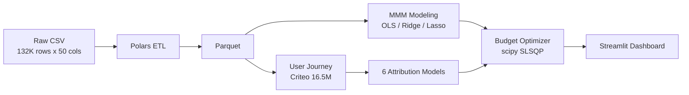

<p align="center">
  <h1 align="center">Marketing Attribution & Budget Optimization</h1>
  <p align="center">
    <b>A full-stack marketing effectiveness evaluation and budget optimization system — from macro MMM to micro multi-touch attribution</b>
  </p>
  <p align="center">
    <a href="https://github.com/MeaFew/attributor/actions"></a>
    
    
    
  </p>
  <p align="center">
    <a href="./README.md">中文</a> | <b>English</b>
  </p>
</p>

---

## Overview

This system is built on the figshare "Conjura Multi-Region MMM Dataset" (covering ~100 e-commerce brands, 19 territories, 132,759 daily records from 2019–2024) and delivers a complete analytical pipeline from **macro Marketing Mix Modeling (MMM)** to **micro user journey attribution** to **budget-constrained optimization**.

Core business problems addressed:

- **Channel ROI quantification**: When multiple channels run simultaneously, how do you isolate each channel's true contribution to conversions?
- **Attribution model selection**: First-touch, Last-touch, Shapley Value, and Removal Effect analysis yield vastly different conclusions — how do you systematically compare them?
- **Budget allocation by intuition**: Under a fixed total budget, how do you scientifically reallocate channel spend to maximize revenue?

---

## Architecture



| Layer | Technology | Rationale |
|-------|------------|-----------|
| Data Cleaning | **Polars** | Vectorized execution + lazy evaluation; processes 132K rows in milliseconds |
| Storage | Parquet | Columnar compression, efficient read/write |
| Macro Modeling | **statsmodels** + **scikit-learn** | OLS provides full statistical inference (p-values, confidence intervals); Ridge/Lasso handles channel collinearity |
| Micro Attribution | 6 self-built models | Covers rule-based (First/Last/Linear/Time-decay) and game-theoretic (Shapley/Removal Effect) approaches for head-to-head comparison |
| Budget Optimization | **scipy.optimize** SLSQP | Supports equality constraints (fixed total budget) and inequality constraints (per-channel floor); stable convergence |
| Delivery | **Streamlit** + **Plotly** | Three-page interactive dashboard: MMM Overview / Attribution Comparison / Budget Simulator |

---

## Quick Start

```bash
git clone https://github.com/MeaFew/attributor.git
cd attributor

# 1. Download MMM dataset (GitHub Releases, ~31MB)
bash download_data.sh

# 2. (Optional but recommended) Download real attribution dataset
#    Criteo Attribution Modeling for Bidding Dataset (~623MB)
#    Place at data/raw/criteo_attribution_dataset.tsv.gz
#    Official: https://ailab.criteo.com/criteo-attribution-modeling-bidding-dataset/

# Install and run
make setup        # Create venv + install dependencies
make all          # Run full pipeline: clean -> MMM -> attribution -> optimize
make dashboard    # Launch Streamlit interactive dashboard
make verify       # Local quality gates (lint + format + test + audit)
```

---

## Core Modules

### 1. Data Preprocessing (`scripts/preprocess.py`)

```
Input:  132,759 rows x 50 cols (heavy nulls + thousand-separator commas)
Output: Cleaned Parquet (daily granularity)
Key operations:
  - Thousand-separator removal + Float64 coercion (fixes Polars auto-inferring String)
  - CTR, CPM, ROAS derived metric calculation
  - Adstock decay feature construction: x_t + 0.5*x_{t-1} + 0.25*x_{t-3} + 0.125*x_{t-7}
  - Temporal feature extraction (year/month/day_of_week/is_weekend)
```

### 2. Marketing Mix Modeling (`scripts/mmm_model.py`)

**Leakage & regularization notes (important):**
- **Chronological split, not random**: MMM is a daily time series; an earlier version fit on all rows and reported R², which is resubstitution (in-sample). We now hold out the last 20% by date and report both in-sample R² and holdout R²/MAE so the generalization gap is visible.
- **Standardized Ridge/Lasso + CV alpha**: an earlier version applied tiny alphas (1.0/0.1) on **unscaled** features, so Ridge/Lasso coefficients were nearly identical to OLS (one model dressed as three). We now `StandardScaler` the features and select alpha via `TimeSeriesSplit` over a log grid (Ridge logspace(-3,3), Lasso logspace(-3,1)) so the shrinkage is real and the three models genuinely differ.

| Model | R² (in-sample) | R² (holdout) | MAE (holdout) | Best Regularization |
|-------|-----|---------|---------|---------------------|
| OLS | 0.542 | 0.440 | 1,816,109 | — |
| **Ridge** | 0.342 | 0.419 | 1,812,313 | alpha = 1000 (CV) |
| Lasso | 0.542 | 0.440 | 1,816,124 | alpha = 10 (CV) |

> Ridge, under the CV-selected large alpha, visibly shrinks coefficients (in-sample R² drops to 0.342 while holdout R² 0.419 stays close to OLS's 0.440) — strong regularization trades a little bias for much more stable coefficients, which matters for out-of-sample budget extrapolation. Lasso selects alpha=10 but zeroes no coefficient (every spend variable is informative). R² ~ 0.54 (in-sample) / 0.44 (holdout) reflects the natural ceiling of aggregate MMM without price/promotion/competitor data; brand-level models can reach 0.70–0.85.

### 3. Multi-Touch Attribution (`scripts/multi_touch_attribution.py`)

Uses the real **Criteo Attribution Modeling for Bidding Dataset** (30 days of live traffic, 16.5M impressions, 6.1M users, 45K conversions). Impression-level data is aggregated by `uid` into user journeys. The Top 10 campaigns are kept as individual channels; the remaining 665 campaigns are grouped into an `other` bucket. Five attribution models plus removal effect analysis are compared:

| Channel | First-Touch | Last-Touch | Linear | Time-Decay | **Shapley** | **Removal Eff.** |
|---------|:-----------:|:----------:|:------:|:----------:|:-----------:|:----------:|
| campaign_10341182 | 4.2% | 5.1% | 4.2% | 5.0% | **4.2%** | **16.9%** |
| campaign_9100693 | 3.2% | 4.7% | 5.3% | 4.4% | **3.3%** | **19.4%** |
| campaign_15184511 | 3.3% | 3.2% | 2.7% | 3.2% | **3.2%** | **16.1%** |
| campaign_30801593 | 3.0% | 3.0% | 3.2% | 2.9% | **2.9%** | **1.1%** |
| campaign_32368244 | 2.4% | 2.9% | 2.4% | 2.8% | **2.4%** | **13.3%** |
| campaign_15398570 | 2.2% | 2.2% | 1.7% | 2.2% | **2.3%** | **5.8%** |
| campaign_29427842 | 1.6% | 1.7% | 1.6% | 1.7% | **1.9%** | **6.5%** |
| campaign_2869134 | 1.9% | 2.9% | 3.5% | 2.7% | **1.9%** | **12.0%** |
| campaign_31772643 | 1.2% | 1.1% | 0.8% | 1.1% | **1.3%** | **5.4%** |
| campaign_28351001 | 1.3% | 1.1% | 0.8% | 1.1% | **1.3%** | **3.5%** |
| **other** | **75.7%** | **72.0%** | **73.7%** | **73.0%** | **75.5%** | **0.0%** |

> Note: Campaign IDs are anonymized Criteo campaign IDs. `other` aggregates the 665 long-tail campaigns outside the Top 10, so it dominates impressions and conversions.

**Key Findings:**

- **Rule-based models (First/Last/Linear/Time-Decay)** are highly consistent on real data: because the `other` bucket covers the vast majority of impressions, all rule-based models assign it 72%–76% of attribution credit.
- **Shapley Value** still provides the most stable allocation on real data. The Top 3 channels (campaign_10341182, campaign_9100693, campaign_15184511) contribute ~11% combined, consistent with rule-based models.
- **Removal Effect** is insensitive to the `other` bucket (removing `other` leaves almost no sample, driving its share to 0%), but it is highly sensitive to individual top campaigns — campaign_9100693 and campaign_10341182 show removal effects of 19.4% and 16.9%, respectively, indicating they have the largest marginal impact on overall conversion rate.
- **Methodological insight**: On real data, differences between attribution models are smaller than on simulated data (because the `other` bucket dominates), but Shapley and Removal Effect still effectively identify the highest-impact campaigns.

### 4. Budget Optimization (`scripts/budget_optimizer.py`)

Uses Ridge MMM coefficients as the asymptotic ceiling of a **saturating channel response function**, with SLSQP solving for optimal allocation under a fixed total budget:

**Response model (saturating, not linear):**

```
revenue_i = coef_i · spend_i^gamma / (spend_i^gamma + tau_i^gamma)
```

where `coef_i` is the Ridge elasticity, `gamma=1.5` the Hill slope, and `tau_i` (half-saturation) is anchored at the channel's current average spend — so the model agrees with the linear elasticity near the observed operating point but bends over (diminishing returns) as spend grows well beyond `tau_i`.

| Scenario | Total Budget | Predicted Revenue (current → optimal) | Uplift |
|----------|-------------|-------------------|--------|
| Current Allocation (Baseline) | 100% | $2,082,150 → — | — |
| **Re-optimized Allocation** | 100% | $2,082,150 → $2,082,159 | **≈ 0.0%** |
| Budget +10% + optimization | 110% | $2,082,150 → $2,082,159 | ≈ 0.0% |
| Budget +20% + optimization | 120% | $2,082,150 → $2,082,157 | ≈ 0.0% |
| Budget -10% + optimization | 90% | $2,082,150 → $2,082,160 | ≈ 0.0% |

> **Honest business insight**: an earlier version used a **linear** response function, under which the budget-constrained optimum degenerates to a trivial greedy corner solution — push all budget to the highest-elasticity channel and extrapolate far outside the training spend range, yielding a fictitious +1.8% uplift (a linear model implies unbounded returns to scale and cannot support budget guidance). With a saturating response, at this brand's current operating point (each channel already near its own `tau`) reallocation yields essentially no extra revenue (≈0%) and incremental budget's marginal return is naturally capped — which is the honest conclusion a budget optimizer should deliver: **the current allocation is already near a local optimum**. Unlocking real optimization headroom requires stronger features (price, promotion, competitor spend) or finer modeling (sub-channel / daypart).

---

## Project Structure

```
attributor/
├── scripts/
│   ├── preprocess.py              # Polars ETL: nulls, thousand-separator handling, adstock, derived metrics
│   ├── mmm_model.py               # OLS + Ridge + Lasso, VIF / Durbin-Watson / residual diagnostics
│   ├── generate_touchpoints.py    # Simulate 50K user journeys based on real channel structure (fallback)
│   ├── preprocess_criteo.py       # Aggregate Criteo impression data into user journeys
│   ├── multi_touch_attribution.py # 6 attribution models: First / Last / Linear / Time-decay / Shapley / Removal Effect
│   └── budget_optimizer.py        # scipy.optimize SLSQP budget-constrained optimization
├── notebooks/
│   └── 01_eda.ipynb               # Exploratory data analysis
├── dashboard/
│   └── app.py                     # Streamlit three-page interactive dashboard
├── tests/
│   ├── test_algorithms.py         # Algorithm unit tests: 6 attribution models (incl. Shapley correctness) + 3 MMM models + budget optimizer
│   ├── test_preprocess.py         # Data cleaning unit tests
│   ├── test_mmm.py                # Model output format and statistic tests
│   └── test_attribution.py        # Attribution normalization and boundary condition tests
├── data/
│   ├── raw/                       # Conjura MMM dataset (figshare)
│   └── processed/                 # Cleaned Parquet
├── reports/
│   └── images/                    # Generated charts
├── config.py                      # Centralized config: paths, channel lists, hyperparameters
├── Makefile                       # Workflow orchestration
├── requirements.txt
└── .github/workflows/ci.yml       # GitHub Actions: lint + test + docker-build
```

---

## Limitations & Production Path

| Limitation | Current Approach | Production Path |
|------------|-----------------|-----------------|
| Multi-touch attribution uses real Criteo data, but campaigns are aggregated | Top 10 campaigns + `other` bucket (665 campaigns) to keep Shapley computation tractable | Integrate directly with CDP/Segment/Tealium for complete, unaggregated user journeys; or use more compute to handle all campaigns |
| MMM is daily granularity | Original daily data provides reasonable temporal resolution | Introduce hour-of-day or daypart features for further refinement |
| No competitive environment variables | Model assumes constant market share | Incorporate competitor spend data (e.g., Pathmatics, Sensor Tower) |
| Single-node execution | Local Parquet | Migrate to Snowflake/BigQuery + dbt pipeline orchestration |
| Budget optimization is static | One-time solve, no dynamic budget adjustment | Reinforcement learning (PPO / MADDPG) for real-time budget bidding |

---

## Related Projects

| Project | Repo | Description |
|---------|------|-------------|
| E-commerce User Analytics | [MeaFew/shoplytics](https://github.com/MeaFew/shoplytics) | 29M real user behavior records, 10 analytical modules |
| Credit Risk Scoring | [MeaFew/riskscore](https://github.com/MeaFew/riskscore) | WOE/IV + XGBoost/LightGBM + SHAP interpretability |
| Multivariate Time Series | [MeaFew/foresight](https://github.com/MeaFew/foresight) | LSTM / Transformer / XGBoost forecasting benchmarks |
| Graph Fraud Detection | [MeaFew/graphguard](https://github.com/MeaFew/graphguard) | GNN illicit transaction detection (Elliptic) |

## License

Code is released under MIT License. Dataset sourced from the publicly available Conjura MMM Dataset on figshare, subject to its usage terms.
