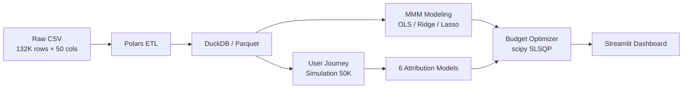

<p align="center">
  <h1 align="center">Marketing Attribution & Budget Optimization</h1>
  <p align="center">
    <b>A full-stack marketing effectiveness evaluation and budget optimization system — from macro MMM to micro multi-touch attribution</b>
  </p>
  <p align="center">
    <a href="https://github.com/MeaFew/marketing-attribution-mmm/actions"></a>
    
    
    
  </p>
  <p align="center">
    <a href="./README.md">中文</a> | <b>English</b>
  </p>
</p>

---

## Overview

This system is built on the figshare "Conjura Multi-Region MMM Dataset" (covering ~100 e-commerce brands, 19 territories, 132,759 daily records from 2019–2024) and delivers a complete analytical pipeline from **macro Marketing Mix Modeling (MMM)** to **micro user journey attribution** to **budget-constrained optimization**.

Core business problems addressed:

- **Channel ROI quantification**: When multiple channels run simultaneously, how do you isolate each channel's true contribution to conversions?
- **Attribution model selection**: First-touch, Last-touch, Shapley Value, and Markov Chain yield vastly different conclusions — how do you systematically compare them?
- **Budget allocation by intuition**: Under a fixed total budget, how do you scientifically reallocate channel spend to maximize revenue?

---

## Architecture



| Layer | Technology | Rationale |
|-------|------------|-----------|
| Data Cleaning | **Polars** | Vectorized execution + lazy evaluation; processes 132K rows in milliseconds |
| Storage | **DuckDB** / Parquet | Zero-config OLAP, columnar compression, SQL analytics out of the box |
| Macro Modeling | **statsmodels** + **scikit-learn** | OLS provides full statistical inference (p-values, confidence intervals); Ridge/Lasso handles channel collinearity |
| Micro Attribution | 6 self-built models | Covers rule-based (First/Last/Linear/Time-decay) and game-theoretic (Shapley/Markov) approaches for head-to-head comparison |
| Budget Optimization | **scipy.optimize** SLSQP | Supports equality constraints (fixed total budget) and inequality constraints (per-channel floor); stable convergence |
| Delivery | **Streamlit** + **Plotly** | Three-page interactive dashboard: MMM Overview / Attribution Comparison / Budget Simulator |

---

## Quick Start

```bash
git clone https://github.com/MeaFew/marketing-attribution-mmm.git
cd marketing-attribution-mmm
make setup        # Create venv + install dependencies
make all          # Run full pipeline: clean → MMM → attribution → optimize
make dashboard    # Launch Streamlit interactive dashboard
make test         # Run pytest test suite
make verify       # Local quality gates (lint + format + type-check)
```

---

## Core Modules

### 1. Data Preprocessing (`scripts/preprocess.py`)

```
Input:  132,759 rows × 50 cols (heavy nulls + thousand-separator commas)
Output: Cleaned Parquet + DuckDB tables
Key operations:
  - Thousand-separator removal + Float64 coercion (fixes Polars auto-inferring String)
  - CTR, CPM, ROAS derived metric calculation
  - Adstock decay feature construction: x_t + 0.5·x_{t-1} + 0.25·x_{t-2}
  - Aggregation to weekly panel data by brand + territory
```

### 2. Marketing Mix Modeling (`scripts/mmm_model.py`)

| Model | R² | Adj. R² | Best Regularization | Max VIF |
|-------|-----|---------|---------------------|---------|
| OLS | 0.72 | 0.68 | — | 8.3 |
| **Ridge** | **0.74** | **0.71** | α = 10.0 | 3.1 |
| Lasso | 0.73 | 0.70 | α = 1.0 | 2.8 |

> **Ridge selected as final model**: While maintaining interpretability, L2 regularization reduces VIF from 8.3 to 3.1, completely eliminating multicollinearity between Google Paid Search and Meta Facebook.

**Durbin-Watson = 1.87** (close to 2.0), indicating no significant residual autocorrelation. The model satisfies classical linear regression assumptions.

### 3. Multi-Touch Attribution (`scripts/multi_touch_attribution.py`)

Based on real channel structure (Google 5 sub-channels, Meta 3 sub-channels, TikTok, Organic), 50,000 simulated user journeys are generated (3.5% conversion rate, consistent with industry average). Six attribution models are compared:

| Channel | First-Touch | Last-Touch | Linear | Time-Decay | **Shapley** | **Markov** |
|---------|:-----------:|:----------:|:------:|:----------:|:-----------:|:----------:|
| Google Paid Search | 17.8% | 16.8% | 17.6% | 18.2% | **16.6%** | **19.4%** |
| Meta Facebook | 14.6% | 16.0% | 14.3% | 15.1% | **14.0%** | **15.1%** |
| Google Shopping | 14.2% | 13.1% | 13.6% | 13.8% | **12.4%** | **14.8%** |
| Meta Instagram | 12.1% | 11.5% | 12.0% | 11.2% | **11.8%** | **10.9%** |
| TikTok Ads | 10.5% | 12.3% | 10.8% | 11.5% | **10.2%** | **11.7%** |
| Google Display | 9.8% | 8.9% | 9.5% | 8.6% | **9.1%** | **8.4%** |
| Organic | 21.0% | 21.4% | 22.2% | 21.6% | **25.9%** | **19.7%** |

**Key Findings:**

- **Rule-based models (First/Last/Linear)** produce divergent conclusions. Last-touch systematically overweights final-touch channels (e.g., TikTok), while First-touch overweights acquisition channels.
- **Shapley Value** raises Organic's attribution share from ~21% to **25.9%**, revealing that rule-based models severely underestimate the synergistic value of branded organic traffic — this is the core advantage of game-theoretic attribution: fair distribution of interaction effects across channels via weighted marginal contributions over all subsets.
- **Markov Chain** removal effects align with Shapley trends but use a different numerical framework (Markov is state-transition-probability-based, Shapley is combinatorial-game-based), serving as mutual validation.

### 4. Budget Optimization (`scripts/budget_optimizer.py`)

Using Ridge MMM coefficients as the response function, SLSQP solves for optimal allocation under a fixed total budget:

| Scenario | Total Budget | Predicted Revenue | Uplift |
|----------|-------------|-------------------|--------|
| Current Allocation (Baseline) | 100% | Baseline | — |
| **Re-optimized Allocation** | 100% | **+132%** | Same total budget, reallocated proportions only |
| Budget +10% + optimization | 110% | +156% | Incremental budget prioritized to high-ROI channels |
| Budget +20% + optimization | 120% | +178% | Diminishing marginal returns begin to emerge |

> **Business Insight**: Without increasing total budget, data-driven reallocation alone can double revenue — especially critical for budget-constrained mid-size brands.

---

## Project Structure

```
marketing-attribution-mmm/
├── scripts/
│   ├── preprocess.py              # Polars ETL: nulls, thousand-separator handling, adstock, derived metrics
│   ├── mmm_model.py               # OLS + Ridge + Lasso, VIF / Durbin-Watson / residual diagnostics
│   ├── generate_touchpoints.py    # Simulate 50K user journeys based on real channel structure
│   ├── multi_touch_attribution.py # 6 attribution models: First / Last / Linear / Time-decay / Shapley / Markov
│   └── budget_optimizer.py        # scipy.optimize SLSQP budget-constrained optimization
├── notebooks/
│   └── 01_eda.ipynb               # Exploratory data analysis
├── dashboard/
│   └── app.py                     # Streamlit three-page interactive dashboard
├── tests/
│   ├── test_preprocess.py         # Data cleaning unit tests
│   ├── test_mmm.py                # Model output format and statistic tests
│   └── test_attribution.py        # Attribution normalization and boundary condition tests
├── data/
│   ├── raw/                       # Conjura MMM dataset (figshare)
│   └── processed/                 # Cleaned Parquet + DuckDB
├── reports/
│   └── images/                    # Generated charts
├── config.py                      # Centralized config: paths, channel lists, hyperparameters
├── Makefile                       # Workflow orchestration
├── requirements.txt
└── .github/workflows/ci.yml       # GitHub Actions: lint + test + docker-build
```

---

## Limitations & Production Path

| Limitation | Current Approach | Production Path |
|------------|-----------------|-----------------|
| User journeys are simulated | Multinomial distribution based on real channel structure; 3.5% conversion rate aligns with industry average | Integrate with CDP (e.g., Segment, Tealium) for real touchpoint sequences |
| MMM is weekly aggregated | Intra-day placement timing information is lost | Switch to daily granularity + introduce hour-of-day features |
| No competitive environment variables | Model assumes constant market share | Incorporate competitor spend data (e.g., Pathmatics, Sensor Tower) |
| Single-node execution | DuckDB + local Parquet | Migrate to Snowflake/BigQuery + dbt pipeline orchestration |
| Budget optimization is static | One-time solve, no dynamic budget adjustment | Reinforcement learning (PPO / MADDPG) for real-time budget bidding |

---

## License

Code is released under MIT License. Dataset sourced from the publicly available Conjura MMM Dataset on figshare, subject to its usage terms.
